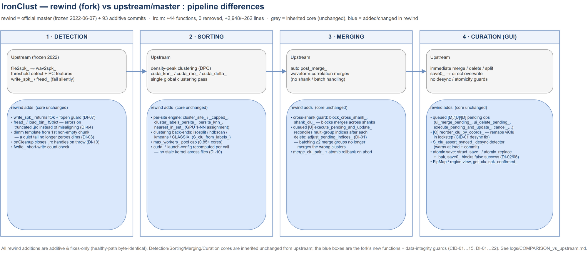

# IronClust
Terabyte-scale, drift-resistant spike sorter for multi-day recordings from [high-channel-count probes](https://www.nature.com/articles/nature24636)

> **Note — this is a fork.** A performance- and workflow-focused fork of
> [IronClust](https://github.com/flatironinstitute/ironclust) (upstream:
> `flatironinstitute/ironclust`). It adds per-site/label-based and CLASSIX clustering,
> parallel and memory-bounded sorting, several manual-GUI improvements, and a number of
> robustness fixes, on top of retuned default parameters.
> **See [What's different from upstream IronClust](#whats-different-from-upstream-ironclust)
> for the full list.**

## Getting Started

## Probe drift handling
IronClust tracks the probe drift by computing the anatomical similarity between time chunks (~20 sec) where each chunk contains approximately equal number of spikes. For each chunk, the anatomical snapshot is computed from the joint distribution bwteen spike amplitudes and positions. Based on the anatomical similarity, each chunk is linked to 15 nearest chunks (self included) forming ~300 sec duration. The linkage is constrained within +/-64 steps (~1280 sec) to handle rigid drift occuring in faster time-scale while rejecting slower changes. The KNN-graph between the spikes is constrained to the linked chunks, such that the neighborhood of spikes from a given chunk is restricted to the spikes from the linked chunks. Thus, drift-resistance is achieved by including and excluding the neighbors based on the activity-inferred anatomical landscape surrounding the probe.

### Prerequisites

- Matlab 
- Matlab signal and image processing toolboxes
- (Optional) CUDA Toolkit (for GPU processing for significant speed-up)
- For terabyte-scale recording: At least 128GB RAM

### Installation
- Clone from Github
```
git clone https://github.com/WeissShahaf/ironclust_but_faster
```
(upstream project: `https://github.com/flatironinstitute/ironclust`)
- (optional) Compile GPU codes (.cu extension)
```
irc2 compile
```

## Quick tutorial

This command creates `irc2` folder in the recording directory and writes output files there.
```
irc2 `path_to_recording_file`
```
Examples 
```
irc2 [path_to_my_recording.mda] (output_dir)  # for .mda format
irc2 [path_to_my_recording.imec#.bin] (output_dir)  # for SpikeGLX Neuropixels recordings (requires `.meta` files)
irc2 [path_to_my_recording.bin] [myprobe.prb] (output_dir) # specify the probe file, output to `myprobe` the recording directory
irc2 [path_to_my_recording.dat] [myprobe.prb] (output_dir)  # for Intan (requires `info.rhd`) and Neuroscope (requires `.xml`) format
```
* `output_dir` (optional): default output location is `irc2` under the recording directory or `myprobe` if the probe file is specified
* `myprobe.prb`: required for Intan and Neuroscope formats. SpikeGLX does not require it if [Neuropixels probe](https://www.neuropixels.org/) is used.

IronClust caches the `path_to_prm_file` for subsequent commands. To display the currently selected parameter file, run
```
irc2 which
```

To select a parameter file (or a recording file):
```
irc2 select [path_to_my_param.prm]
irc2 select [path_to_my_recording]
```

Rerun using new parameters (up to four parameters can be specified, no spaces between name=value pairs):
```
irc2 rerun [path_to_my_param.prm] [name1=val1] [name2=val2] [name3=val3]
irc2 rerun [name1=val1] [name2=val2] [name3=val3] [name4=val4]  # uses a cached parameter file
```

To visualize the raw or filtered traces and see clustered spikes on the traces, run (press 'h' in the UI for further help)
```
irc2 traces [path_to_my_recording] 
irc2 traces [path_to_my_param.prm]
```

Manual clustering user interface
```
irc2 manual [path_to_my_recording] 
irc2 manual [path_to_my_param.prm]
```

This command shows the parameter file (`.prm` extension) used for sorting
```
irc2 edit `path_to_recording_file`
```

To select a new parameter file, run
```
irc2 select `path_to_prm_file`
```

You can re-run the sorting after updating the sorting parameter by running 
```
irc2 `path_to_recording_file`
```
IronClust only runs the part of sorting pipeline affected by the updated parameters. 

You can initialize the sorting output by running either of the following commands:
```
irc2 clear `path_to_recording_file`
irc2 clear `output_directory`
irc2 clear `path_to_prm_file`
```

## What's different from upstream IronClust

This fork tracks `flatironinstitute/ironclust` (diverged at upstream `master`, commit
`2d7b56c`, frozen 2022) and adds the following. Items marked *(default change)* alter
out-of-the-box behaviour relative to upstream; everything else is additive or a bug fix.
At the function level: **`matlab/irc.m` gains 55 functions and removes 0** (+3,559 / −296
lines); no upstream function was deleted.



*Stage-by-stage view of what this fork changes across **detection · sorting · merging ·
curation** — grey = inherited upstream core (unchanged), blue = fork additions. Editable
source: [`logs/WORKFLOW_diff_vs_upstream.drawio`](logs/WORKFLOW_diff_vs_upstream.drawio) ·
vector: [`logs/WORKFLOW_diff_vs_upstream.svg`](logs/WORKFLOW_diff_vs_upstream.svg) · full
written diff: [`logs/COMPARISON_vs_upstream.md`](logs/COMPARISON_vs_upstream.md).*

### New clustering methods
- **Per-site, label-based clustering** — `vcCluster = 'kmeans' | 'hdbscan' | 'isosplit6'`.
  Each detection site is clustered independently on its local features (over-segmentation),
  then the normal cross-site post-merge collapses duplicates. HDBSCAN is a pure-MATLAB
  implementation; ISO-SPLIT tries the Python `isosplit6` backend and falls back to a bundled
  pure-MATLAB `isosplit5`. See [Clustering methods](#clustering-methods) and
  [matlab/CLUSTERING_METHODS.md](matlab/CLUSTERING_METHODS.md).
- **CLASSIX clustering** — `vcCluster = 'classix'` (fast sorting-based clustering) and, as a
  post-merge refinement, `post_merge_mode0 = 21`. See
  [matlab/CLASSIX_USAGE.md](matlab/CLASSIX_USAGE.md).
- Label-based methods keep their own labels (an internal `fLabelClu` flag makes `fet2clu_`
  skip the density-peak `postCluster_`).

### Performance
- **Parallel per-site clustering** — the kmeans/HDBSCAN/isosplit per-site loop runs across
  workers when `fParfor = 1` *(default change: `fParfor` is now `1`)*, capped by
  `nWorkers_clust`.
- **Per-site spike cap** — `maxSpk_persite_clust` bounds the O(n²) kNN/clustering cost on huge
  (usually noise) sites by clustering a random subsample and assigning the rest to the nearest
  member. *(default change: now `100000`; set to `[]` for the upstream byte-identical
  no-cap behaviour)*. Applies to `kmeans`/`hdbscan`/`isosplit6` only — not to DPC or
  `classix`. Example: a 1.1 M-spike site drops from ~80 min to ~90 s at `m = 50000`. See
  [`logs/plan_persite_spike_cap.md`](logs/plan_persite_spike_cap.md) and
  [`logs/investigation_maxSpk_persite_clust.md`](logs/investigation_maxSpk_persite_clust.md).
- **Faster automated post-merge — `post_merge_` 247 s → 113 s (−54%)** on a 5267 s / 16.9 M-spike
  / 661-cluster recording, in three steps, each verified byte-identical on that recording:
  the merge kernel reads the validated `cviSpk_clu` cache instead of rescanning `viClu`
  (**31.2 s → 21.6 s**); the second `S_clu_wav_` recomputes only the clusters the refractory
  pass actually changed (**247 s → 179 s**); and the opt-in `nSpk_max_clu_wav` caps how many
  spikes the cluster-template median consumes (**179 s → 113 s** at `10000`, *default off*).
  Measurements, and the longer list of merge-mode optimizations that were measured and
  **rejected**, are in
  [`logs/ironclust_post_merge_followup_2026-08-06.md`](logs/ironclust_post_merge_followup_2026-08-06.md).
- **I/O and detection tuning** — larger load blocks (`MAX_LOAD_SEC = 10`, larger `nPad_filt`),
  Wiener detection filter by default, plus GUI/plot performance work. The parameter values are
  the authoritative source: see the annotated defaults in
  [`matlab/default.prm`](matlab/default.prm) and the dated change logs under [`logs/`](logs/).

### Robustness & bug fixes
- Hardened the **post-merge and per-site paths** against empty / single-spike / gappy-label
  clusters (the many-small-cluster case produced by label methods + spike cap). No healthy run
  changes its output. (`logs/changes_log20260626.md`, `logs/plan_postmerge_robustness.md`.)
- Fixed **GUI "Merge auto"** silently discarding merges (a sign-flip regression in
  `post_merge_wav_`).
- Fixed cluster **merge / delete** bugs and added defensive sizing of cluster-quality arrays in
  manual curation.
- **`min_count` was never enforced on label-based sorts.** It is applied only inside
  `postCluster_`, which `post_merge_` skips for `kmeans`/`hdbscan`/`isosplit6`/`classix` — so
  those sorts could keep 8-spike clusters under a `min_count = 50` setting. The new opt-in
  **`fEnforce_min_count`** fixes it; see [Enforcing `min_count`](#enforcing-min_count) below.
- **`S_clu_sort_` left waveform and quality fields in the pre-sort cluster order**, so a
  re-sorted `S_clu` could carry per-cluster arrays that no longer lined up with their clusters.
  They are now permuted with everything else. The bug was masked because `post_merge_`
  unconditionally rebuilt those fields afterwards — which is also why the rebuild could then be
  made incremental (the two are one finding).
- **`irc detect` was broken on the GPU** between 2026-07-18 and 2026-08-07: a data-integrity fix
  had switched a spike-window index expression to `int64`, which **`gpuArray` does not support**,
  and the per-site `try/catch` *degraded* instead of stopping — 383 of 384 sites silently produced
  zero waveforms before the run finally aborted. The index type is now `double` (exact to 2^53,
  works on `gpuArray`), which keeps the original overflow protection for >20 h recordings; a sweep
  found and fixed two further sites of the same pattern, one of them in `irc2.m`. Running detect on
  the GPU again is worth ~2×. If you have a sort detected in that window with `fGpu = 1`, check it
  with `sum(squeeze(all(all(S_clu.trWav_spk_clu == 0, 1), 2)))` — it should be `0`.

### Data integrity & cluster-identity hardening

A large share of this fork's fixes target **silent data corruption / loss** in manual curation
and persistence — bugs that could write a bad `_jrc.mat` with no error raised. All are additive
guards: a healthy run is byte-identical to upstream.

- **`viClu` ⇄ `cviSpk_clu` desync (CID-01…15).** The `[O]` "reorder by coordinates" and the
  delete/merge paths could permute the per-cluster spike-index cache without remapping the
  authoritative per-spike labels (`viClu`), silently corrupting cluster identity on save.
  `reorder_clu_by_coords_` now remaps `viClu` in lockstep, and `S_clu_assert_synced_` verifies
  the invariant `all(viClu(cviSpk_clu{i}) == i)` at both load and commit.
- **Multi-group `[U]` merge (DI-01).** Applying ≥2 queued merge groups at once re-indexed the
  later groups incorrectly and merged the wrong clusters (the result was internally consistent,
  so it was undetectable after the fact). `execute_pending_and_update_` now reconciles the
  not-yet-processed groups after each in-group delete.
- **Cross-shank merge guard.** `block_cross_shank_` / `shank_clu_` prevent merging clusters that
  live on different shanks — in both the automated post-merge and manual `[M]`/`[U]`.
- **Atomic saves (DI-02/05).** `struct_save_` writes to a temp file, renames it into place, keeps
  a `.bak`, and refuses to commit an empty temp; `save0_` blocks and reports on failure instead
  of reporting false success. This guards a good `_jrc.mat` against crash / lock truncation.
- **Strict I/O on the feature path (DI-03/04/07).** `fread_` / `load_bin_` gain a strict mode so a
  truncated `_spkfet.jrc` errors out instead of silently misaligning clustering features;
  `write_spk_` returns a success flag and guards its file handle; the dimensions template is built
  from the first non-empty chunk so a quiet tail no longer zeroes dims.

The full 22-item audit is in
[`logs/ISSUE_TRACKER_data_integrity.md`](logs/ISSUE_TRACKER_data_integrity.md); the
cluster-identity family is tracked in
[`logs/ISSUE_TRACKER_cluster_identity.md`](logs/ISSUE_TRACKER_cluster_identity.md).

**Read-only diagnostics for existing sorts.** Because the desync predates its fix, this fork ships
tools to test already-sorted `_jrc.mat` files for it — `check_jrc_sync.m`, `scan_jrc_report.m`,
`analyze_desync.m`, `export_desync_clusters.m` (all strictly read-only — they never write a
`_jrc.mat`). See [`logs/DATASET_INTEGRITY_REPORT.md`](logs/DATASET_INTEGRITY_REPORT.md).

```matlab
check_jrc_sync('path\to\recording_jrc.mat')   % PASS / DESYNC verdict for one file, folder or list
```

A `PASS` means "currently self-consistent", not "never corrupted".

**Repairing a desynced sort.** A DESYNC verdict *is* recoverable without a full re-sort — detection
artifacts (`_spkfet` / `_spkraw` / `_spkwav`) and the kNN graph are cached on disk, so only the fast
clustering-finalize is redone:

- **`resync_clu.m`** *(preferred)* — keeps the curated `viClu` numbering and rebuilds the
  `cviSpk_clu` cache, waveforms, positions and quality from it. Curation and cluster annotations
  survive, and the result stays aligned with the exported spike-times CSV.
- **`recover_from_snapshot.m`** — resets `viClu` to the pre-merge snapshot and re-runs the automated
  post-merge. **Discards all manual curation**, including the per-cluster notes that downstream
  pipelines use to select units, so only use it on a file that will be curated again by hand.
  **Check the snapshot before relying on it:** `post_merge_` rewrites `viClu_premerge` on *every*
  run, and on a **label-based** sort the value it stores is whatever `viClu` held at that moment —
  the *curated* labelling, not a clean automatic baseline — because `postCluster_` is skipped and
  so nothing regenerates `viClu` first. On DPC sorts it is a genuine baseline.
- **`repair_clu_sync.m`** — rebuilds `viClu` *from* the cache. Dry run by default
  (`repair_clu_sync(jrc_file)`); pass a second path to write a repaired copy. In practice it
  **refuses to write** on every file observed so far — overlapping cache entries, orphaned spikes
  and resurrected deleted clusters mean the two sides describe different partitions, not a
  relabelling — so treat it as a **diagnostic**. Note that its "direction check" is circular by
  construction and proves nothing; only the *purity* block is informative.

Never repair a desync with `S_clu_refresh_`: it rebuilds the cache from `viClu` — the opposite
direction — and locks the corruption in irreversibly.

### Manual curation / GUI
- **Deferred-edit workflow** — queue merges/deletes and apply them together with `u` (cancel
  with `Esc`).
- **Drift view shown by default.**
- **Probe-map site labels, region colouring & zoom** — in the probe map (`e`): `c` cycles the
  site labels between channel #, site # and anatomical region; `v` toggles the box colour
  between amplitude and region independently of the labels; `b` zooms to the selected cluster's
  site ±5 sites (region source: `vcFile_site_region`).
  See [Manual curation → Probe map window](#probe-map-window).
- **Cluster annotations** — `1` / `2` / `3` / `4` mark a unit as single / multi / noise /
  axonal.
- **`irc recurate`** — reopen the GUI from a fresh automatic clustering without the
  load-vs-recompute prompt, behind a consent dialog that spells out what it discards. See
  [Starting over from the automatic clustering](#starting-over-from-the-automatic-clustering--irc-recurate).

### Changed default parameters *(behaviour changes vs upstream)*

| Parameter | Upstream | This fork | Purpose |
|---|---|---|---|
| `fParfor` | `0` | `1` | parallelise per-site clustering |
| `MAX_LOAD_SEC` | `[]` | `10` | fewer, larger I/O blocks |
| `nPad_filt` | `300` | `150000` | 0.5 s filter-edge overlap at 30 kHz |
| `vcFilter_detect` | `''` | `'wiener'` | detection filter |
| `vcCommonRef` | `'mean'` | `'none'` | local referencing |
| `freqLimNotch` | `{}` | `{[48,52]}` | 50 Hz mains notch |
| `qqFactor` | `4.5` | `5` | detection threshold |
| `spkLim_ms` | `[-.25, .75]` | `[-.3, 1.25]` | wider waveform window |
| `blank_thresh` | `[]` | `8` | reject artifact bursts |
| `maxDist_site_spk_um` | `75` | `85` | waveform extraction radius |
| `post_merge_mode0` | `[12, 15, 17]` | `[12, 17]` | auto-merge sequence |
| `fCheckSites` | `0` | `1` | auto-reject bad sites |
| `fWav_raw_show` | `0` | `1` | show raw waveforms |
| `fText` | `1` | `0` | hide per-unit counts by default |
| `nShow_proj` | `500` | `50` | faster projection view |

### New parameters
- **Clustering:** `classix_*` (`radius`, `minPts`, `merge_tiny`, `use_mex`, `verbose`),
  `kmeans_*`, `hdbscan_*`, `isosplit_*`, `nWorkers_clust`, `maxSpk_persite_clust`.
- **Detection thresholds (opt-in, mostly commented in `default.prm`):** a fixed/global/smoothed
  threshold hierarchy (`fUseGlobalThresh`, `fSmoothThresh`, `vcSmoothMethod`, `nSmoothWindow`,
  `nSmoothOverlap`, `smoothSigma`) and `fDiagnosticMode`.
- **Post-merge (opt-in, both default off ⇒ behaviour unchanged):** `fEnforce_min_count`
  (apply `min_count` after the automated merge) and `nSpk_max_clu_wav` (cap the spikes used for
  each cluster-template median; recommended value `10000` if enabled). `nSpk_max_clu_wav` does
  **not** change merge decisions — merging computes its own similarity from its own 4000-spike
  subsample — but it does change stored templates, `mrWavCor`, and the SNR/amplitude columns of
  the quality CSV, so it changes what a curator sees.
- **Revived:** `fDiscard_count` shipped in every `.prm` for years but was read by **no** `.m`
  file. It is now live, and only when `fEnforce_min_count = 1`.
- **Manual GUI:** `vcFile_site_region` (CSV of site→region for the probe map).

`matlab/default.prm` is the authoritative parameter list with inline docs. Per-topic
documents live alongside the code
([CLUSTERING_METHODS.md](matlab/CLUSTERING_METHODS.md),
[CLASSIX_USAGE.md](matlab/CLASSIX_USAGE.md)) and dated change logs under [`logs/`](logs/).

### Enforcing `min_count`

`min_count` is applied **only** inside `postCluster_`, and `post_merge_` skips `postCluster_`
entirely for the label-based methods (`kmeans`, `hdbscan`, `isosplit6`, `classix`). Nothing
downstream substitutes for it — per-site clustering gates on the *site's* spike total, not on each
label it returns; `S_clu_remove_empty_` removes only **empty** clusters. So on a label-based sort
`min_count` does nothing, which is why such sorts can end with clusters far below it (measured:
68 of 661 clusters under a `min_count = 50` setting, the smallest holding 8 spikes).

Set `fEnforce_min_count = 1` to apply it after the automated merge. `fDiscard_count` then picks
the action:

| Setting | Action on a cluster below `min_count` |
|---|---|
| `fDiscard_count = 0` *(default)* | **absorb** it into the nearest surviving cluster, losing no spikes |
| `fDiscard_count = 1` | move its spikes to noise (`viClu = 0`) — the legacy DPC semantics; **those spikes are gone** |

Absorption uses **centroid distance** (median spike position), not waveform similarity — a
sub-threshold cluster's mean waveform is noise-dominated — and is capped at `maxDist_site_um`.
Targets are drawn only from clusters already at or above `min_count`, so there is no chaining and
the result is order-independent. **A small cluster with no surviving neighbour inside the radius
is left untouched** — never force-merged, never discarded — and the count is reported.

`fEnforce_min_count` had to be a separate flag because `fDiscard_count` historically shipped as `1`
everywhere: honouring it directly would have made every existing label-based sort start deleting
clusters it currently keeps. With `fEnforce_min_count = 0` (the default) the sort is byte-identical
to before.

**`fDiscard_count` now defaults to `0` (absorb), changed 2026-09-02** — in the code fallback and in
`default.prm` / `rhs32_template.prm` / `sample_sample_merge.prm`. Turning on a size floor is a
request to enforce a minimum, not to throw spikes away, so the lossy action is the one you opt into.
This changes nothing unless `fEnforce_min_count = 1`. **An existing `.prm` on disk still carries the
old `fDiscard_count = 1`** — check the file, not just the default, before enabling the floor on an
old parameter set.

## Clustering methods

The primary clustering algorithm is selected with the `vcCluster` parameter (set it in the
`.prm` file, then re-sort). The default `drift-knn` is the drift-resistant density-peak (DPC)
method described under [Probe drift handling](#probe-drift-handling).

In addition to the native DPC methods, IronClust includes **per-site, label-based** methods.
These cluster the spikes of each detection site independently and let the automated post-merge
combine matching units across sites:

| `vcCluster` | Method | Notes |
|---|---|---|
| `drift-knn` *(default)* | Drift-resistant KNN density-peak | native DPC |
| `spacetime` | Spatiotemporal decentralized DPC | native DPC, handles slow drift |
| `drift` | Fast drift clustering | native DPC |
| `xcov` | Waveform-covariance features | native DPC |
| `kmeans` | Per-site k-means | requires Statistics & ML Toolbox |
| `hdbscan` | Per-site HDBSCAN | pure MATLAB |
| `isosplit6` | Per-site ISO-SPLIT | tries Python `isosplit6`, falls back to pure-MATLAB `isosplit5` |
| `classix` | CLASSIX | label-based |

Each method has tunable parameters (e.g. `isosplit_isocut_threshold`, `hdbscan_minPts`,
`hdbscan_minClusterSize`, `kmeans_k`). See **[matlab/CLUSTERING_METHODS.md](matlab/CLUSTERING_METHODS.md)**
for the full parameter reference and `matlab/default.prm` for defaults.

To switch method, set `vcCluster` in your `.prm` (e.g. `vcCluster = 'isosplit6';`) and re-sort:
```
irc sort [path_to_my_param.prm]
```

## Manual curation

Open the manual curation GUI:
```
irc manual [path_to_my_param.prm]
```
The cluster waveform view uses a **deferred-edit** workflow: queue merges/deletes, then apply
them together with `u` (or cancel with `Esc`). Press `h` in the GUI for built-in help.

### Starting over from the automatic clustering — `irc recurate`

`irc manual` asks whether to load the last saved curation or recompute. `irc recurate` is the
"recompute" answer with no chance of mis-clicking "load":

```
irc recurate [path_to_my_param.prm]
```

**This is destructive** and is gated behind an OK/Cancel dialog that names each consequence
before anything happens: all merges, splits and deletes are discarded; the per-cluster notes
(`csNote_clu`) are reset — which matters, because a downstream pipeline selecting units by
`note == 'single'` in the exported `_quality.csv` will see **none** until the sort is curated
again; and `<prm>_log.mat`, the only record of the curation outside the `_jrc.mat`, is deleted
(a copy is kept as `<prm>_log.mat.bak_recurate`).

On **label-based** sorts it additionally overwrites `viClu_premerge`, the snapshot
`recover_from_snapshot.m` restores from — `post_merge_` rewrites that field on every run, and on
these sorts the value it stores is the *curated* labelling rather than a clean automatic baseline.
The dialog says so when it applies.

### Re-running the auto-merge from the raw baseline — `irc reset-to-premerge`

`irc auto` re-runs the automated post-merge **on top of the current `viClu`** — i.e. on the
already-merged (and any curated) clustering — so it *compounds* merges. To retune the merge
(`post_merge_mode`, `maxWavCor`, …) you usually want it applied from scratch instead of stacked on
prior merges. `irc reset-to-premerge` (alias `irc reset-premerge`) does that without a full re-sort:

```
irc reset-to-premerge [path_to_my_param.prm]
```

It resets `viClu` to the raw pre-merge baseline (`viClu_premerge`), re-runs `post_merge_` with the
current `.prm` parameters, and saves — reusing the detection/feature/kNN caches, so it is fast
(minutes, no re-detect/re-cluster). Like `irc auto`/`irc recurate` **it overwrites the `_jrc.mat`
and discards curation** (a `.bak` is kept). It is idempotent: `post_merge_` re-stores
`viClu_premerge` from the reset `viClu`, so repeating it always starts from the same baseline. It
errors if `viClu_premerge` is absent and warns if that snapshot looks like it was already
overwritten by a prior `auto`/`recurate` (see the note above).

> **Merge knobs on label-based sorts (`isosplit`/`kmeans`/`hdbscan`/`classix`).** `post_merge_mode0`
> is read only inside `postCluster_`, which these sorts **skip**, so it has **no effect** — the merge
> is governed by the scalar `post_merge_mode` (waveform template merge; mode `17` compares clusters
> across sites via `clu_wave_similarity_paged`, mode `1` only same-site), the `maxWavCor` threshold,
> and the automatic cross-site `post_merge_wav4_` pass. To iterate these quickly **without** writing
> to disk, `matlab/sweep_post_merge.m` re-runs `post_merge_` in memory over a list of
> `[post_merge_mode, maxWavCor]` rows from the raw baseline and prints the resulting cluster counts.

### Keyboard shortcuts (cluster waveform view)

| Key | Action |
|---|---|
| `←` / `→` | Select previous / next cluster |
| `Shift`+`←` / `→` | Move the second (comparison) cluster selection |
| `Home` / `End` | Jump to first / last cluster |
| `Space` | Zoom and auto-select the most similar cluster for comparison |
| `0` | Clear the second cluster selection |
| `↑` / `↓` | Increase / decrease the waveform amplitude scale |
| `z` | Zoom to the selected cluster |
| `r` | Reset the view |
| `m` | Queue a merge of the two selected clusters |
| `d` / `Delete` / `Backspace` | Queue deletion of the selected cluster |
| `s` | Auto-split the selected cluster |
| `u` | Apply all queued (pending) merges/deletes and update |
| `Esc` | Cancel all pending operations |
| `o` | Reorder clusters by probe coordinates |
| `1` / `2` / `3` / `4` | Annotate selected cluster as single / multi / noise / axonal |
| `w` | Toggle individual spike waveforms |
| `n` | Toggle cluster number/count labels |
| `a` | Refresh the selected cluster's spikes |
| `f` | Show cluster info / statistics |
| `t` | Time vs. amplitude view |
| `c` | Cross-correlogram |
| `i` | ISI histogram |
| `v` | ISI return map |
| `e` | Probe / amplitude map (in that window, `c` cycles channel #/site #/region labels + region colouring — see below) |
| `j` | Drift view |
| `p` | PSTH (requires a trial file) |
| `h` | Help |

### Probe map window

The probe map (opened with `e`, top-left) draws each site as a box coloured by the selected
cluster's peak-to-peak amplitude. That window has its own controls:

| Key | Action |
|---|---|
| `c` | Cycle the site labels: **channel #** → **site #** → **region** |
| `v` | Toggle the box **colour** source: amplitude (Vpp) ↔ region — independently of the label mode |
| `b` | Toggle **zoom**: the selected cluster's site ±5 sites ↔ the whole shank (default) |
| `h` | Help |

`v` is a no-op (with a message) when the recording has no region labels.

In **region** mode the boxes are colour-coded by anatomical region (one colour per region).
Region labels are read from a CSV named by the `vcFile_site_region` parameter in your `.prm`:

```
vcFile_site_region = 'path/to/sites_region.csv';
```

The CSV holds `key,region` rows, where `key` is either a **channel number** (matched against
`viSite2Chan`) or a **1-based site index**; a header row is allowed. Sites the CSV does not
cover are labelled `?`. If the parameter is empty or the file is missing, `c` simply cycles
channel # ↔ site #.

## Importing multiple `.bin` files from [SpikeGLX](https://github.com/billkarsh/SpikeGLX)
```
irc2 import-spikeglx [path_to_my_recording.bin] [path_to_probe_file.prb] (path_to_output_dir)
```
- `path_to_output_dir` (optional): defalt location is 'probe_name' under the recording dorectory.
- Output format is [.mda format](https://users.flatironinstitute.org/~magland/docs/mountainsort_dataset_format/) 
- Probe file (`.prb`) is required unless Neuropixels probe is used. [`.prb` file format](https://github.com/JaneliaSciComp/JRCLUST/wiki/Probe-file)
- `path_to_my_recording.bin`: you may use a '\*' character to join multiple files, or provide a text (`.txt`) file containing a list of files to be merged in a specified order (a text file containing the list is created when you use '\*' character). 

## Importing multiple `.dat` files from [Intan RHD format](http://intantech.com/downloads.html?tabSelect=Software&yPos=0)
```
irc2 import-intan [path_to_my_recording.bin] [path_to_probe_file.prb] (path_to_output_dir)
```
- This step is not necessary if all channels are saved to a single file.
- `path_to_my_recording.bin`: Use '\*' character to join all channels that are saved to separate files.

## Deployment

- IronClust can run through SpikeForest2 or spikeinterface pipeline
- IronClust output can be exported to Phy, Klusters, and JRClust formats for manual clustering

## Export to Phy
Export to [Phy](https://github.com/kwikteam/phy-contrib/blob/master/docs/template-gui.md) for manual curation. You need to clone Phy and set the path `path_phy_x` where x={'pc,'mac','lin'} to open the output automatically.
```
irc2 export-phy [path_to_prm_file] (output_dir)   # default output location is `phy` under the output folder
```

If Phy doesn't open automatically, run the following python command to open Phy
```
phy template-gui path_to_param.py
```

## Export to Klusters
Export to [Klusters](http://neurosuite.sourceforge.net/) for manual curation. You can set the path `path_klusters_x` in `user.cfg` where x = {'pc', 'mac', 'lin'} to open the output automatically.
```
irc2 export-klusters [path_to_prm_file] (output_dir)
```
* output_dir (optional): default output location is `klusters` under the same directory.

If Klusters doesn't open automatically, open Klusters GUI and open `.par.#` file (#: shank number). 

## Export to JRCLUST
Export to [JRCLUST](https://github.com/JaneliaSciComp/JRCLUST) for manual curation. You need to clone JRCLUST and set the path `path_jrclust` in `user.cfg` (you need to create this file if it doesn't exist).
```
irc2 export-jrclust [path_to_prm_file]
```
* output_dir: it creates a new JRCLUST parameter file by appending `_jrclust.prm` at the same directory.

If JRCLUST doesn't open automatically, run `jrc manual [my_jrclust.prm]`

## Contributing

Please read [CONTRIBUTING.md](https://gist.github.com/PurpleBooth/b24679402957c63ec426) for details on our code of conduct, and the process for submitting pull requests to us.

## Versioning

To display the current version, run
```
irc2 version
```

## Authors

- James Jun, Center for Computational Mathematics, Flatiron Institute
- Jeremy Magland, Center for Computational Mathematics, Flatiron Institute

## License

This project is licensed under the MIT License - see the [LICENSE](LICENSE) file for details

## Acknowledgments

* We thank our collaborators and contributors of the ground-truth datasets to validate our spike sorting accuracy through spikeforest.flatironinstitute.org website.
* We thank [Loren Frank's lab](https://www.cin.ucsf.edu/HTML/Loren_Frank.html) for contributing the terabyte-scale 10-day continuous recording data.

* We thank [Dan English's lab](https://www.englishneurolab.com/) for contributing four-day uLED probe recordings.

